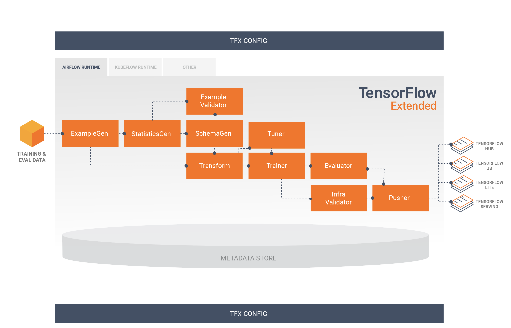

# Tensorflow Extended Sentiment Analysis Model

## Model

Model is built using TFX pipeline.



The input data is transformed in the graph using TFX transform for better dependency management and faster prediction. The model is trained using TFX trainer. The model is deployed using TFX pusher and served using TF serving. The model is tested using TFX evaluator.  


## Data
This is the <a href="https://www.kaggle.com/datasets/kazanova/sentiment140">sentiment140 dataset</a>. It contains 1,600,000 tweets extracted using the twitter api . The tweets have been annotated (0 = negative, 4 = positive) and they can be used to detect sentiment. The dataset is equally balanced.

## Evaluation
**COnfusion Matrix**


**Classification Report**


## Run
To train the model:

bash run.sh:
```sh
    $ python -m venv .venv
    $ source .venv/bin/activate
    $ pip install -r requirements.txt
    $ python run_pipeline.py
```
